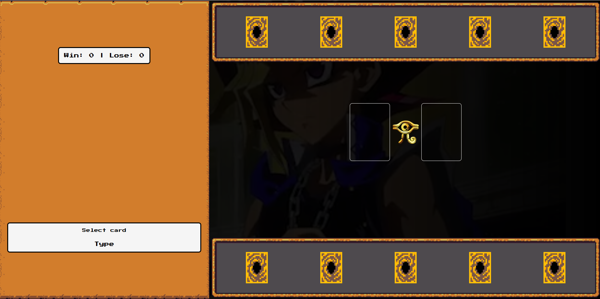
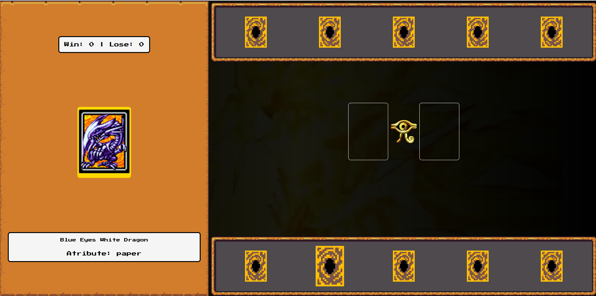
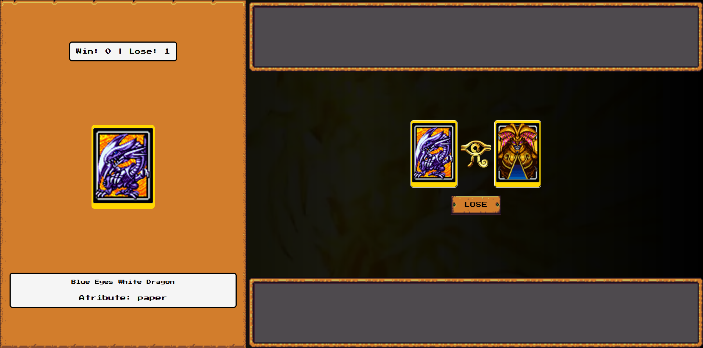
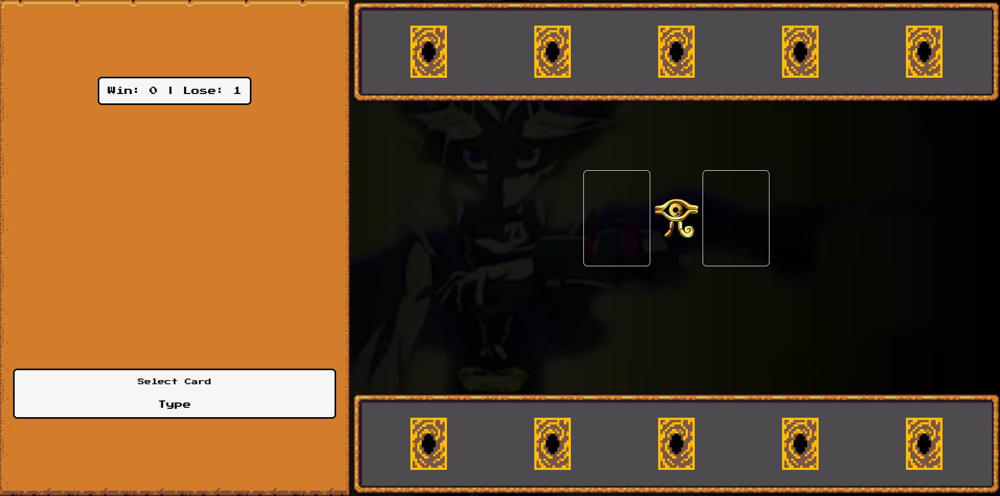

# Jogo de Cartas Yu-Gi-Oh

Bem-vindo ao repositório do **Jogo de Cartas Yu-Gi-Oh**, um projeto interativo inspirado no famoso jogo de cartas do universo Yu-Gi-Oh. Este jogo foi desenvolvido com o objetivo de criar uma experiência divertida e nostálgica para os fãs da franquia.

## 📜 Sobre o Projeto

Este jogo simula um duelo de cartas onde jogadores podem:
- Escolher cartas do baralho.
- Combater usando atributos específicos de cada carta.
- Determinar um vencedor com base nos valores de ataque, defesa ou outros critérios.

O projeto foi desenvolvido para reforçar habilidades de programação, utilizando JavaScript, HTML e CSS.

## 🚀 Tecnologias Utilizadas

- **HTML5**: Para a estrutura do jogo.
- **CSS3**: Para estilização e design responsivo.
- **JavaScript**: Para a lógica do jogo e interatividade.

## 🎮 Como Jogar

1. Clone o repositório:
   ```bash
   git clone https://github.com/marcelodecarli/jogoCartasYu-Gi-Oh.git
   ```


2. Navegue até a pasta do projeto:
```bash
cd jogoCartasYu-Gi-Oh
```

3. Abra o arquivo `index.html` em um navegador.

4. Interface inicial do jogo:
- Sendo as cartas de baixo do player e as de cima do computador;



5. Jogando:

- Primeiro você pode passar o mouse em cima de suas cartar para saber qual carta você jogará. Ela aparecerá no painel esquerdo;



6. Clicando na carta:

- Ao clicar em sua carta, automaticamente o computer faz a sua jogada, aparecerá o resultado. Na imagem o player perdeu. Computando 1 para Lose na parte superior do painel esquerdo `Win: 0 | Lose: 1`;




7. Após o resultado clicando no botão que aparecerá abaixo das cartas serão redistribuídas novas cartas para ambos os jogadores;


8. Jogando novamente;


